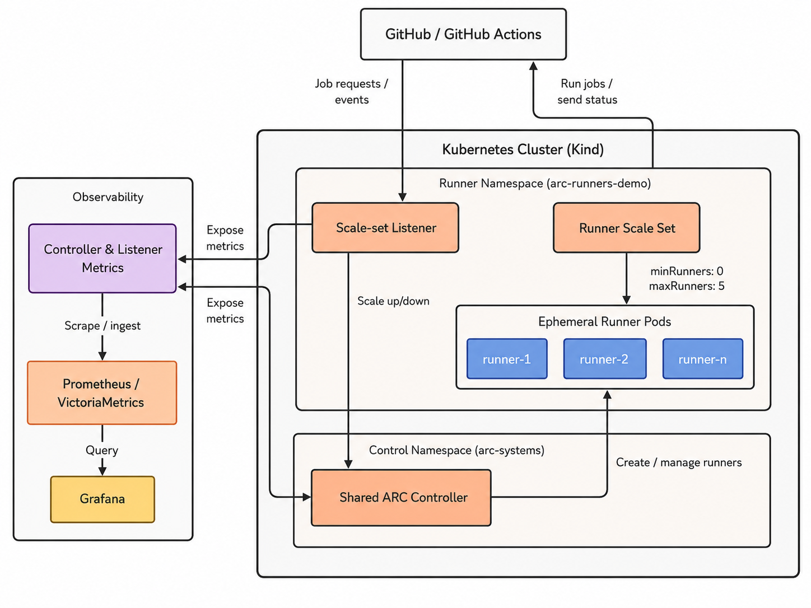

# GitHub Actions Runner Controller on Kind

This example runs GitHub Actions Runner Controller (ARC) on a local Kind cluster. It is intended for platform engineers who want to test a single repository runner scale set, GitHub App authentication, and runner autoscaling before designing a production deployment.

The example uses Kind for local testing. It is not a production-ready runner platform.

## Table of Contents

* [Purpose](#purpose)
* [Architecture](#architecture)
* [Prerequisites](#prerequisites)
* [Quick Start](#quick-start)
  * [Create the Cluster](#create-the-cluster)
  * [Configure GitHub Authentication](#configure-github-authentication)
  * [Install ARC](#install-arc)
  * [Run a Test Workflow](#run-a-test-workflow)
  * [Verify Runner Scaling](#verify-runner-scaling)
* [Observability](#observability)
* [Optional Argo CD Deployment](#optional-argo-cd-deployment)
* [Limitations](#limitations)
* [Cleanup](#cleanup)

## Purpose

The example demonstrates how to:

* run one shared ARC controller;
* register a repository-level runner scale set with a GitHub App;
* create ephemeral runner pods when workflow jobs are queued;
* scale runners with ARC itself, without HPA or KEDA; and
* optionally collect ARC metrics and deploy the resources with Argo CD.

The main path covers one GitHub organization and one repository. The repository also contains multi-organization examples, but they are outside this guide.

## Architecture



The controller and listener run in `arc-systems`. The `AutoscalingRunnerSet` and ephemeral runner pods run in `arc-runners-demo`. The GitHub App credentials are stored in a Kubernetes Secret in the runner namespace.

The listener receives job demand from GitHub and adjusts the desired runner count between `minRunners: 0` and `maxRunners: 5`. Each runner pod normally handles one job and is then removed. ARC and the runners initiate outbound HTTPS connections, so GitHub does not require an inbound connection to the local cluster.

## Prerequisites

* Docker
* Kind
* `kubectl`
* Helm
* `make`
* A GitHub.com repository and permission to install a GitHub App
* Outbound HTTPS access to GitHub and GHCR

The static validation targets also require Ruby, `jq`, and `kubeconform`.

## Quick Start

### Create the Cluster

```bash
make kind-up
kubectl config current-context
```

The expected context is `kind-arc-runners`.

### Configure GitHub Authentication

Create and install a GitHub App for the repository. For repository-level runners, grant it these repository permissions:

* `Administration: Read and write`
* `Metadata: Read-only`

Generate a private key, then create the Kubernetes Secret:

```bash
export GITHUB_APP_ID='<app-id>'
export GITHUB_APP_INSTALLATION_ID='<installation-id>'
export GITHUB_APP_PRIVATE_KEY_FILE='/absolute/path/to/private-key.pem'
make create-secret
```

The helper creates `github-app-credentials` in `arc-runners-demo`. The Secret must exist in the same namespace as the runner scale set. Do not commit the private key or a populated Secret manifest.

### Install ARC

Optionally validate and render the charts before installation:

```bash
make validate
make template
```

Install the shared controller and runner scale set:

```bash
make install-controller
make install-runners GITHUB_CONFIG_URL=https://github.com/<organization>/<repository>
```

Check the installation:

```bash
kubectl get pods -n arc-systems
kubectl get autoscalingrunnersets -n arc-runners-demo
```

The charts are pinned in [`versions.env`](versions.env). The runner scale set name is `miroslav-kind-runners`.

### Run a Test Workflow

Copy [`examples/scaling-workflow.yaml`](examples/scaling-workflow.yaml) to `.github/workflows/arc-scaling-demo.yml` in the configured GitHub repository. Commit the file, then run **ARC scaling demo** from the repository's Actions tab.

The workflow starts five jobs with:

```yaml
runs-on: miroslav-kind-runners
```

### Verify Runner Scaling

Watch the runner namespace while the workflow runs:

```bash
kubectl get pods -n arc-runners-demo -w
```

The scale set should start at zero runners, create up to five runner pods, complete the jobs, remove the pods, and return to zero.

Check the controller and scale set directly:

```bash
kubectl get pods -n arc-systems
kubectl get autoscalingrunnersets -n arc-runners-demo
```

## Observability

The optional chart exposes controller and listener metrics and provides two `ServiceMonitor` resources and a Grafana dashboard. It expects the observability stack from [`../k8s-observability-golden-path`](../k8s-observability-golden-path/README.md); it does not install monitoring operators or CRDs.

```bash
make -C ../k8s-observability-golden-path install \
  PROFILE=kind NAMESPACE=observability CLUSTER_NAME=arc-runners
make install-observability
make -C ../k8s-observability-golden-path grafana NAMESPACE=observability
```

Open `http://localhost:3000` and select **GitHub ARC Runner Scale Sets**.

After installing the controller, scale set, and observability resources, run the live resource checks:

```bash
make verify
```

This target checks Kubernetes resources and endpoints. It does not start or verify a GitHub workflow job.

## Optional Argo CD Deployment

The `argocd/` directory contains an optional AppProject and Applications for the same controller, runner scale set, and observability chart. Argo CD is not installed by this example.

Replace every `OWNER/REPOSITORY` placeholder in `argocd/`, create `github-app-credentials` in `arc-runners-demo`, and run:

```bash
make argocd-apply
```

The runner listener still runs in `arc-systems`, while the scale set and runner pods run in `arc-runners-demo`.

## Limitations

* Kind provides a local test environment, not production availability or isolation.
* Self-hosted workflows execute repository-controlled code. Do not use this cluster for sensitive workloads.
* Runner pods have no Docker daemon or persistent workspace.
* Static checks do not test GitHub registration, workflow execution, live scaling, Grafana rendering, or Argo CD synchronization.
* Production deployments still require decisions about isolation, capacity, upgrades, credential management, and log retention.

## Cleanup

Remove the ARC releases and namespaces, then delete the Kind cluster:

```bash
make cleanup
make kind-down
```

`make cleanup` retains the shared `observability` namespace. Remove that stack separately if it was created only for this example.
