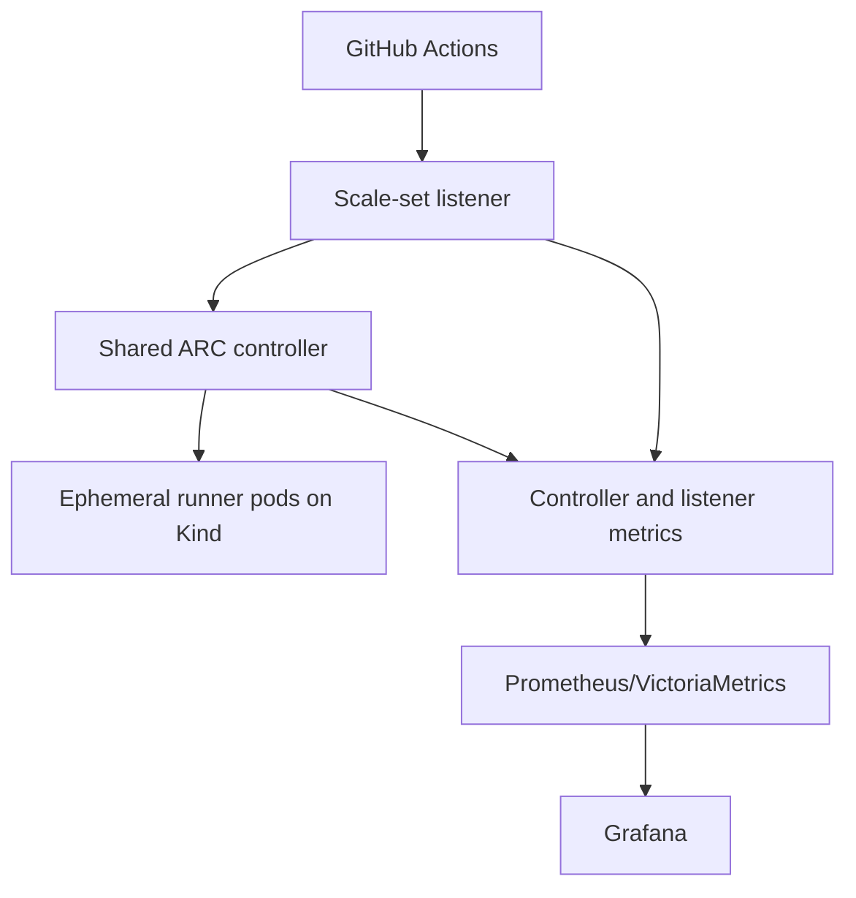

# GitHub ARC runners on Kind

> **Status: Work in progress.** Static rendering and the controller smoke test pass; GitHub registration, runner scaling, live dashboards, and Argo CD synchronization remain unverified.

This lab installs Actions Runner Controller (ARC) `0.14.2` on Kind, registers one repository-level autoscaling runner scale set, and connects ARC metrics to the repository's existing VictoriaMetrics and Grafana example. Direct Helm installation is the default path; Argo CD manifests are optional.



The listener pod runs in `arc-systems`; runner pods and the `AutoscalingRunnerSet` run in `arc-runners-demo`. GitHub sends work over outbound HTTPS connections initiated by ARC and the runners. No inbound connection from GitHub to the local machine is required.

## Runner Scale Sets vs. Legacy RunnerDeployment

`RunnerDeployment` and `HorizontalRunnerAutoscaler` belong to ARC's older deployment model. This example uses GitHub's current autoscaling runner scale set model: `gha-runner-scale-set-controller` installs the controller, while `gha-runner-scale-set` creates a listener and ephemeral runners. The listener receives job demand from GitHub and updates the desired runner count within `minRunners` and `maxRunners`; workflows target the installation or scale-set name through `runs-on`. Runner pods normally handle one job and are then removed. This is not a migration guide, and legacy fields do not necessarily have one-to-one scale-set equivalents.

## Prerequisites

- Docker, Kind, `kubectl`, Helm, `make`, Ruby, `jq`, and `kubeconform`.
- A GitHub repository on GitHub.com and permission to install a GitHub App on it.
- Outbound HTTPS access from the Kind nodes to GitHub and GHCR.
- Approximately 6 CPU cores, 12 GiB RAM, and 15 GiB free disk for Kind, five runners, and the observability stack. Reduce concurrency if the host is smaller.

The pinned version comes from the [official ARC 0.14.2 release](https://github.com/actions/actions-runner-controller/releases/tag/gha-runner-scale-set-0.14.2). Both official OCI charts are pinned to that version in [`versions.env`](versions.env); `latest` is not used for chart selection.

## Layout

- `values/`: upstream controller and scale-set values; no credentials.
- `charts/arc-observability/`: two metric Services, two ServiceMonitors, and one Grafana dashboard ConfigMap.
- `examples/`: secret helper, placeholder Secret, and five-job workflow.
- `argocd/`: optional AppProject, Applications, and multi-organization ApplicationSet.
- `scripts/`: static rendering, live verification, and cleanup.

## GitHub authentication

GitHub App authentication is the primary path. Per [GitHub's ARC authentication documentation](https://docs.github.com/en/actions/how-tos/manage-runners/use-actions-runner-controller/authenticate-to-the-api), configure an organization-owned GitHub App with:

- Repository permissions: `Administration: Read and write` and `Metadata: Read-only` for repository-level registration.
- Organization permissions: `Self-hosted runners: Read and write` for organization-level registration. Repository `Administration` is not required for organization-level registration.

Install the App on the selected organization/repository and generate a private key. Create the Secret directly in the runner namespace; do not apply the placeholder manifest with real values and do not commit the key.

```bash
export GITHUB_APP_ID='<app-id>'
export GITHUB_APP_INSTALLATION_ID='<installation-id>'
export GITHUB_APP_PRIVATE_KEY_FILE='/absolute/path/to/private-key.pem'
make create-secret
```

The helper creates `github-app-credentials` in `arc-runners-demo`. ARC requires the pre-existing Secret to be in the same namespace as the runner scale-set release. [`examples/github-app-secret.example.yaml`](examples/github-app-secret.example.yaml) documents the expected keys with placeholders only.

For a short local test against a personal-account repository, a classic PAT is an optional fallback. GitHub documents the `repo` scope for repository runners. Store it only in Kubernetes:

```bash
kubectl create namespace arc-runners-demo --dry-run=client -o yaml | kubectl apply -f -
read -rsp 'GitHub PAT: ' GITHUB_PAT; echo
kubectl -n arc-runners-demo create secret generic github-app-credentials \
  --from-literal=github_token="$GITHUB_PAT"
unset GITHUB_PAT
```

## Kind setup

```bash
make kind-up
kubectl config current-context
```

The expected context is `kind-arc-runners`. The cluster has one control-plane and one worker; it does not install a registry.

## Direct Helm installation

Validate and render the pinned charts first:

```bash
make validate
make template
```

Create credentials as described above, then install one shared controller and one repository runner scale set:

```bash
make install-controller
make install-runners GITHUB_CONFIG_URL=https://github.com/<owner>/<repository>
```

Check the releases and controller:

```bash
helm list -n arc-systems
helm list -n arc-runners-demo
kubectl get pods -n arc-systems
kubectl get autoscalingrunnersets -n arc-runners-demo
```

`values/demo-repository.yaml` sets `runnerScaleSetName: miroslav-kind-runners`, `minRunners: 0`, and `maxRunners: 5`. ARC's listener-driven scaling is the only autoscaler; the lab installs neither HPA nor KEDA. Runner pods use the official Actions runner image, are unprivileged, and have no Docker daemon or persistent workspace.

`make install` combines the controller, runner, and repository-owned observability releases after the cluster and Secret already exist. It does not install the larger observability stack.

## Run the scaling workflow

Copy [`examples/scaling-workflow.yaml`](examples/scaling-workflow.yaml) into the configured repository as `.github/workflows/arc-scaling-demo.yml`, commit it, and run **ARC scaling demo** from the Actions tab. The five matrix entries use:

```yaml
runs-on: miroslav-kind-runners
```

Observe runner creation in another terminal:

```bash
kubectl get pods -n arc-runners-demo -w
```

Expected behavior is zero runners, up to five ephemeral runner pods after dispatch, job completion, pod removal, and return to zero. GitHub delivery and Kubernetes scheduling times vary, so no exact timing is asserted.

## Metrics and Grafana

The pinned chart values were inspected before configuring metrics. Controller metrics are enabled through `metrics.controllerManagerAddr`; listener metrics use the chart's `listenerMetrics` maps. The labels are limited to scale-set name, namespace, organization, repository, and job result. Workflow names, workflow refs, event names, and job names are intentionally omitted to limit cardinality.

This repository's observability example uses Prometheus Operator `ServiceMonitor` resources, which VictoriaMetrics Operator converts for collection. Its Grafana sidecar discovers ConfigMaps labeled `grafana_dashboard=1`, and its Prometheus-compatible datasource UID is `prometheus`. The local chart follows those conventions and does not install monitoring software or CRDs.

Install the existing stack, then the ARC resources:

```bash
make -C ../k8s-observability-golden-path install \
  PROFILE=kind NAMESPACE=observability CLUSTER_NAME=arc-runners
make install-observability
make -C ../k8s-observability-golden-path grafana NAMESPACE=observability
```

Open `http://localhost:3000` and select **GitHub ARC Runner Scale Sets**. The dashboard shows desired, registered, busy and idle runners; assigned and running jobs; completed jobs by result; utilization; p95 startup and execution durations; and saturation against `maxRunners`. Queries group by runner namespace and scale-set name and use `increase()` for completed-job counters and `rate()` for histogram buckets.

After running the lab, capture a real dashboard screenshot from Grafana and place it under `docs/images/`. No screenshot is committed because this task did not execute a credentialed workflow.

## Optional Argo CD path

Argo CD is not installed by this example. Replace every `OWNER/REPOSITORY` placeholder in `argocd/`, create `github-app-credentials` first, and confirm that your Argo CD installation can pull public OCI Helm charts. Some installations require registering `ghcr.io/actions/actions-runner-controller-charts` as a Helm repository with OCI enabled.

```bash
make argocd-apply
```

The AppProject restricts destinations to `arc-systems`, `arc-runners-demo`, and `observability`, and grants only the cluster-scoped kinds required by the ARC charts. All Applications enable automated sync, prune, self-heal, and `CreateNamespace=true`. The observability Application expects this example to be committed at the configured Git repository and branch.

## Multi-organization extension

One controller can manage multiple scale sets. [`values/organization-a.example.yaml`](values/organization-a.example.yaml) and [`values/organization-b.example.yaml`](values/organization-b.example.yaml) show distinct URLs, namespaces, names, runner groups, Secrets, bounds, and resources. Install each values file as another `gha-runner-scale-set` release in its documented namespace, with its own pre-created Secret. The optional [`ApplicationSet`](argocd/multi-organization-applicationset.example.yaml) expresses the same two-item pattern.

Use a separate controller only when administrative ownership, failure-domain isolation, upgrade schedules, or strict organizational boundaries require it. This lab does not build a multi-tenant runner platform.

## Verification

Static checks need no cluster credentials:

```bash
make validate
make template
```

After a configured installation, run:

```bash
make verify
```

The live target checks the controller, listener, `AutoscalingRunnerSet`, ServiceMonitors, metric Services, dashboard ConfigMap, namespaces, and absence of installed legacy resources. It does not trigger or assert a GitHub job.

Useful direct checks:

```bash
kubectl get pods -n arc-systems
kubectl get pods -n arc-runners-demo
kubectl get servicemonitors -n observability
kubectl get endpointslices -n arc-systems
```

## Troubleshooting

- No listener pod: inspect `kubectl describe autoscalingrunnerset -n arc-runners-demo miroslav-kind-runners` and controller logs. Check the repository URL, Secret name/namespace, App installation, and permissions.
- Workflow stays queued: `runs-on` must exactly match `miroslav-kind-runners`, and repository Actions settings must allow the runner.
- Runner pods stay pending: inspect events and reduce matrix concurrency or increase Docker resources.
- Metrics target is empty: verify both Services have EndpointSlices and both ServiceMonitors exist in `observability`. A listener endpoint cannot exist until ARC successfully creates the listener.
- Dashboard is missing: confirm the Grafana sidecar searches `observability` and the ConfigMap has `grafana_dashboard=1`.
- OCI pull fails: confirm outbound access to `ghcr.io` and that Helm can authenticate to the registry if local policy requires it.

## Cleanup

Remove only this lab's releases and ARC namespaces:

```bash
make cleanup
make kind-down
```

`make cleanup` retains the shared `observability` namespace and its stack. Remove that stack separately with its own documented uninstall command if it was created only for this lab.

## Security limitations

Self-hosted workflows execute repository-controlled code. This Kind cluster is a local learning environment and must not share a cluster with sensitive production workloads. Ephemeral pods reduce persistence but do not make every untrusted workload safe. Never commit credentials, and design external log retention and broader isolation separately for production. This example is not a complete production security design.

## What was tested

The chart version, published OCI artifacts, values schema, metrics names, rendered Kubernetes resources, local chart, YAML, shell syntax, Argo CD document structure, dashboard JSON, datasource UID, credential guardrails, and legacy-resource guardrails are statically testable.

GitHub registration, listener readiness, runner scale-out/scale-in, workflow execution, live metric samples, Grafana rendering, Argo CD synchronization, and a real screenshot require external systems or credentials. They were intentionally not tested for this task.

Primary references: [ARC concepts](https://docs.github.com/en/actions/concepts/runners/actions-runner-controller), [deploy runner scale sets](https://docs.github.com/en/actions/how-tos/manage-runners/use-actions-runner-controller/deploy-runner-scale-sets), [authenticate ARC](https://docs.github.com/en/actions/how-tos/manage-runners/use-actions-runner-controller/authenticate-to-the-api), and the [official ARC repository](https://github.com/actions/actions-runner-controller).
