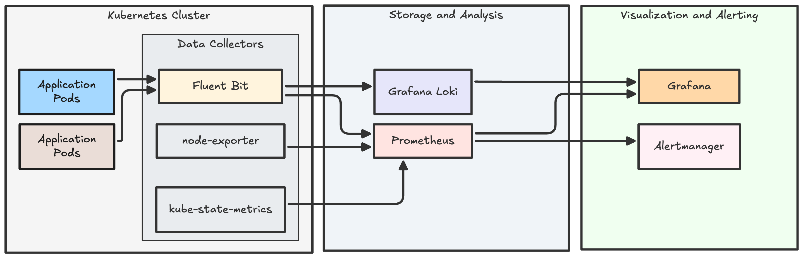

# Kubernetes Observability Golden Path

Reliable Kubernetes observability baseline installed with Helmfile through Make.

## What It Installs

- kube-prometheus-stack: Prometheus, Alertmanager, Grafana, kube-state-metrics, node-exporter, and default kube-prometheus rules
- Loki
- Fluent Bit for container logs and Kubernetes Events
- Git-provisioned Grafana folder `Golden Path` with exactly five dashboards
- Repository-owned Prometheus recording rules and gap-filling alerts
- Demo workload and live validators

## Scope and Non-goals

This is cluster observability. It does not provide application request rate, latency, or error rate unless applications, ingress controllers, or service meshes expose those metrics. It does not install Tempo, OpenTelemetry Collector, Mimir, Thanos, service mesh dashboards, or business metrics.

## Architecture



## Requirements

- Kubernetes cluster with a default StorageClass, or set `STORAGE_CLASS`
- `kubectl`, `helm`, `helmfile`, `python3`, `jq`, `promtool`
- `shellcheck` for optional shell linting

## Quick Start

```bash
make doctor
make install PROFILE=kind
make validate
make demo-up
make test
make grafana
```

Use `PROFILE=local` for Minikube, Docker Desktop, k3d, or a small development cluster with a working default StorageClass.

## Production Configuration

`PROFILE=production` is a reference profile, not a universal production promise. It uses persistent Prometheus and Alertmanager storage, single-replica Grafana with a PVC-backed SQLite database, and Loki `Distributed` mode with object storage.

Minimum practical production shape: at least 3 worker nodes, a working default or selected StorageClass, object storage for Loki, and enough capacity for the requests in `environments/production/`.

Required production inputs:

```bash
export LOKI_OBJECT_STORE_BUCKET=<bucket>
export LOKI_OBJECT_STORE_REGION=<region>
export LOKI_OBJECT_STORE_ENDPOINT=<optional-endpoint>
make install PROFILE=production CONFIRM_PRODUCTION=yes
```

Do not commit object-store credentials. Use workload identity, an existing Secret, or an external secret controller.

## Storage

- Prometheus uses `prometheus.prometheusSpec.storageSpec`.
- Loki kind/local use SingleBinary mode with filesystem PVC.
- Loki production uses object storage and Distributed microservices.
- Grafana uses one replica. Persistence is enabled in production and dashboards remain Git-provisioned.
- Alertmanager uses persistent storage in production so silences and notification state survive restarts.
- `make uninstall` keeps PVCs. `make purge CONFIRM_PURGE=yes` deletes PVC data.

## Configuration Variables

`PROFILE`, `NAMESPACE`, `CLUSTER_NAME`, `ENVIRONMENT`, `STORAGE_CLASS`, `PROMETHEUS_STORAGE_SIZE`, `PROMETHEUS_RETENTION`, `LOKI_STORAGE_SIZE`, `LOKI_RETENTION`, `GRAFANA_STORAGE_SIZE`, `ALERTMANAGER_STORAGE_SIZE`.

`NAMESPACE` defaults to `observability`. If `CLUSTER_NAME` is unset, it is derived from the current Kubernetes context and sanitized for labels. `ENVIRONMENT` is independent from `CLUSTER_NAME`.

## Make Targets

Run `make help` for the target list. Write targets print the Kubernetes context and refuse production writes unless `CONFIRM_PRODUCTION=yes`.

## Dashboards

Exactly five dashboards are provisioned under `Golden Path`:

- Cluster Health
- Workload Health
- Capacity & Saturation
- Logs & Events
- Observability Stack Health

Prometheus dashboard queries do not assume raw Kubernetes metrics have a `cluster` label. Loki queries use Fluent Bit labels: `cluster`, `environment`, `namespace`, `workload`, `container`, `source`, `reason`, and `type`.

## Alerts

kube-prometheus-stack default rules are enabled. This repository adds only gap-filling alerts for Fluent Bit drops/retries, Loki discards/ingestion failures, and PVC pressure. Every custom alert has a runbook under `runbooks/`.

## Demo and Tests

```bash
make demo-up
make demo-failures
make demo-reset
make demo-down
make test
```

Failure fixtures are isolated in `golden-path-demo` and do not use absurd CPU or memory requests.

## Upgrade Procedure

Update `versions.yaml`, review official chart values, run:

```bash
make validate
make template PROFILE=kind
make template PROFILE=local
```

Then install on a disposable cluster and run `make demo-up && make test`.

## Troubleshooting

- Storage failures: run `make doctor` and confirm the default or selected StorageClass.
- Empty dashboards: run `make demo-up`, wait two minutes, then `make test`.
- Grafana password: run `make credentials`.
- Loki production failures: verify object-store bucket, region, endpoint, and workload identity or Secret wiring.

## Security

No credentials belong in Git. The static validator scans tracked files for common secret-looking assignments, but that is a guardrail, not a replacement for review.

## Version Pins

Pins live in `versions.yaml`. Chart repositories are the official prometheus-community, grafana, and fluent Helm repositories.
