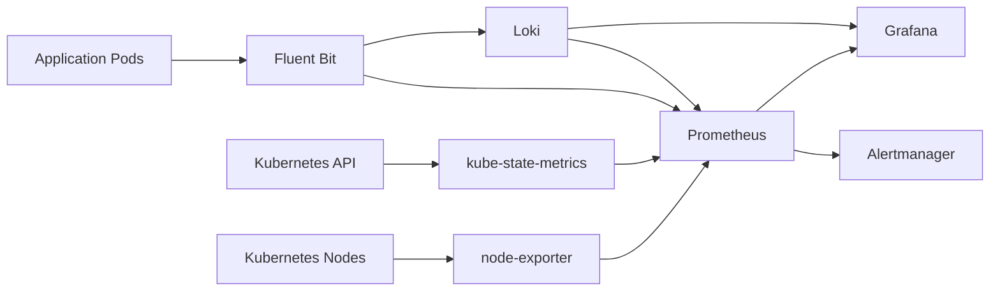

# Architecture

Application logs flow through Fluent Bit into Loki. Kubernetes and node metrics flow into Prometheus through node-exporter, kube-state-metrics, Fluent Bit metrics, and Loki metrics. Grafana reads Prometheus and Loki, and Prometheus sends alerts to Alertmanager.

Dashboard screenshots are stored under [docs/images](images/).
